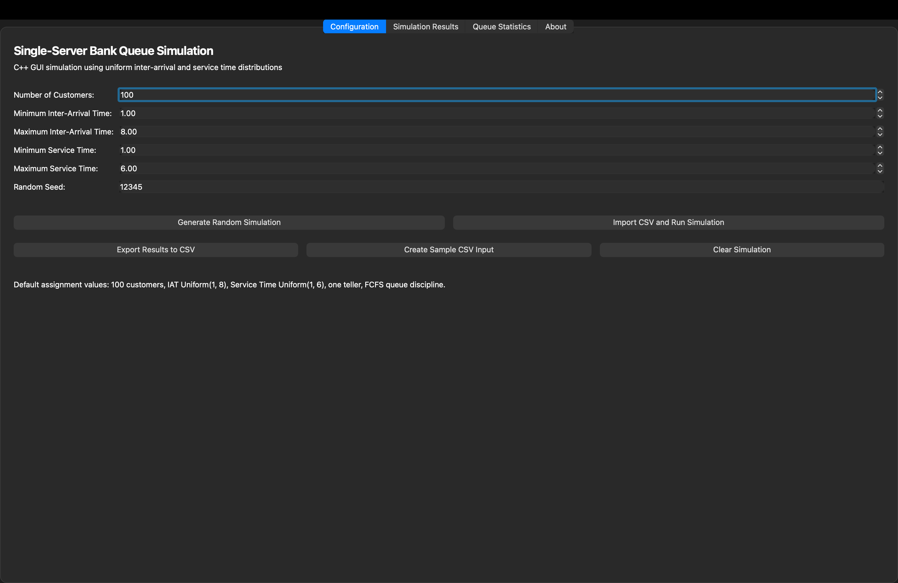
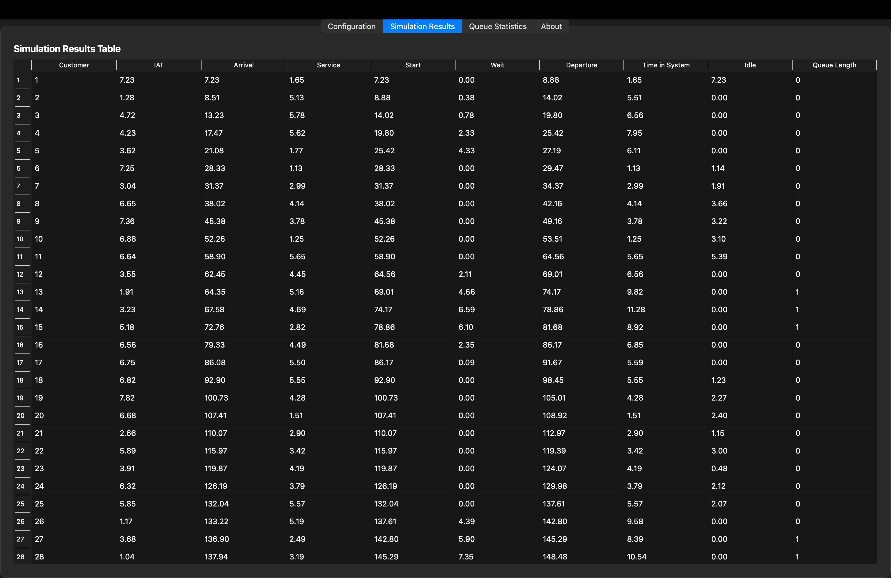
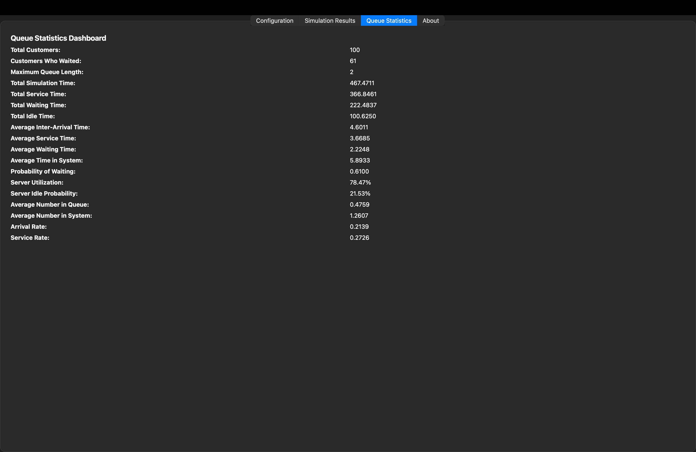
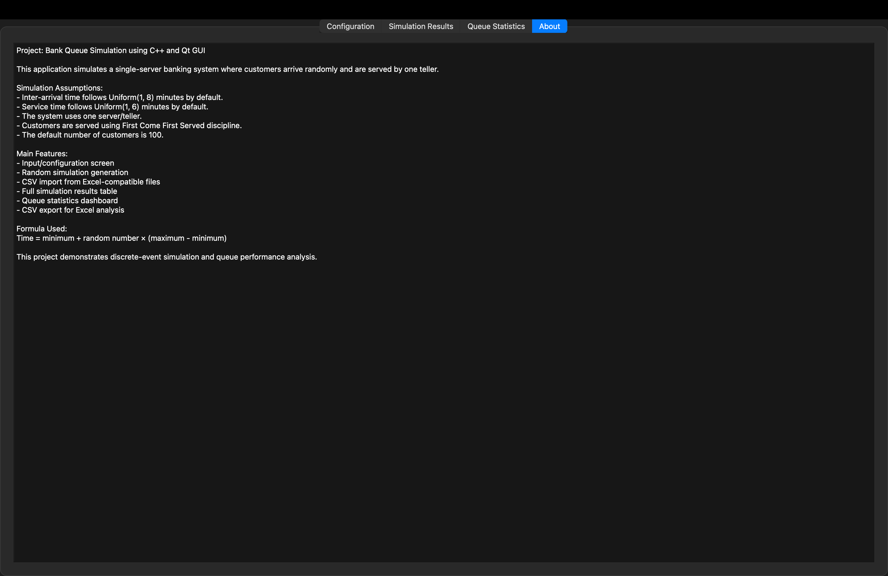
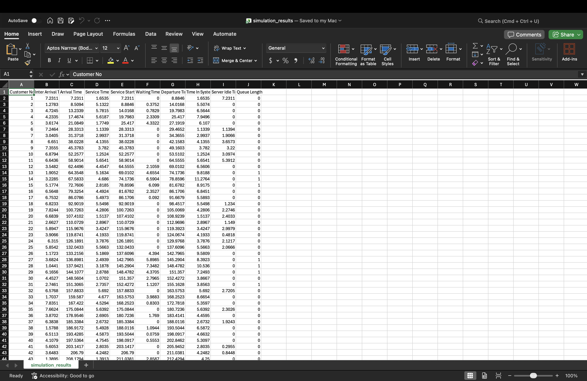

# Single Server Bank Queue Simulation - C++ GUI

## Overview

This project simulates a **single-server banking queue system** using **C++ and Qt GUI** for a Computer Simulation and Modelling assignment.

The system models a bank where customers arrive randomly and are served by one teller using the **First Come First Served (FCFS)** queue discipline. The simulation runs for **100 customers**, generates inter-arrival times and service times using uniform distributions, displays the full simulation table, calculates queue statistics, and supports CSV/Excel import and export.

---

## Authors

* **Ian Wambaire** - Author
* **Denzel Sam Omondi**

---

## Assignment Parameters

The simulation uses the following default values:

* Number of customers: **100**
* Inter-arrival time: **Uniform(1, 8) minutes**
* Service time: **Uniform(1, 6) minutes**
* Number of servers: **1**
* Queue discipline: **First Come First Served**

---

## Features

* C++ GUI application using Qt
* Input/configuration screen
* Random inter-arrival time generation
* Random service time generation
* Simulation results table
* Queue statistics dashboard
* CSV import for Excel-compatible data
* CSV export for simulation results
* CSV export for queue statistics
* Sample CSV input generation
* Clean multi-file project structure

---

## Technologies Used

* C++
* Qt 6 Widgets
* CMake
* CSV file handling
* Git and GitHub
* Excel / Apple Numbers / Google Sheets

---

## Formula Used

Random values are converted to time values using:

```text
Time = minimum + random_number × (maximum - minimum)
```

For inter-arrival time:

```text
IAT = 1 + R(8 - 1)
IAT = 1 + 7R
```

For service time:

```text
Service Time = 1 + R(6 - 1)
Service Time = 1 + 5R
```

Where `R` is a random number between 0 and 1.

---

## Simulation Calculations

| Field              | Calculation                                         |
| ------------------ | --------------------------------------------------- |
| Arrival Time       | Previous Arrival Time + Inter-Arrival Time          |
| Service Start Time | max(Arrival Time, Previous Departure Time)          |
| Waiting Time       | Service Start Time - Arrival Time                   |
| Departure Time     | Service Start Time + Service Time                   |
| Time in System     | Departure Time - Arrival Time                       |
| Server Idle Time   | max(0, Arrival Time - Previous Departure Time)      |
| Queue Length       | Number of customers waiting when a customer arrives |

---

## Queue Statistics Computed

The application calculates:

* Average inter-arrival time
* Average service time
* Average waiting time
* Average time in system
* Number of customers who waited
* Probability of waiting
* Server utilization
* Server idle probability
* Average number in queue
* Average number in system
* Maximum queue length
* Arrival rate
* Service rate
* Total simulation time
* Total idle time

---

## Project Structure

```text
BankQueueSimulation/
│
├── src/
│   ├── main.cpp
│   ├── MainWindow.h
│   ├── MainWindow.cpp
│   ├── Customer.h
│   ├── QueueSimulator.h
│   ├── QueueSimulator.cpp
│   ├── QueueStatistics.h
│   ├── CSVHandler.h
│   └── CSVHandler.cpp
│
├── data/
│   ├── sample_input.csv
│   ├── simulation_results.csv
│   └── queue_statistics.csv
│
├── screenshots/
│   ├── configuration-tab.png
│   ├── simulation-results-tab.png
│   ├── queue-statistics-tab.png
│   ├── about-tab.png
│   └── excel-output.png
│
├── CMakeLists.txt
├── README.md
└── .gitignore
```

---

## Recommended Branch

The recommended branch for running and demonstrating the project is:

```text
main
```

---

## How to Run on macOS

### 1. Clone the repository

```bash
git clone https://github.com/ianwambaire/single-server-bank-queue-simulation.git
cd single-server-bank-queue-simulation
```

### 2. Make sure you are on the main branch

```bash
git checkout main
```

### 3. Install Qt and CMake

```bash
brew install qt cmake
```

### 4. Build the project

```bash
rm -rf build
mkdir build
cd build
cmake .. -DCMAKE_PREFIX_PATH=$(brew --prefix qt)
make
```

### 5. Run the application

```bash
./BankQueueSimulationGUI
```

---

## How to Run on Windows

### 1. Install required software

Install the following:

* **Git**
* **CMake**
* **Qt 6**
* **MinGW or MSVC compiler**
* **Visual Studio Code** or **Qt Creator**

The easiest method is to install **Qt Creator** from the official Qt installer and include:

* Qt 6.x
* Qt Widgets
* MinGW compiler, or MSVC if using Visual Studio Build Tools
* CMake

### 2. Clone the repository

Open Command Prompt, PowerShell, or Git Bash:

```bash
git clone https://github.com/ianwambaire/single-server-bank-queue-simulation.git
cd single-server-bank-queue-simulation
```

### 3. Make sure you are on the main branch

```bash
git checkout main
```

### 4. Build using Qt Creator

1. Open **Qt Creator**.
2. Click **Open Project**.
3. Select the project’s `CMakeLists.txt` file.
4. Choose a Qt kit, for example:

   * Desktop Qt 6.x MinGW 64-bit, or
   * Desktop Qt 6.x MSVC 64-bit
5. Click **Configure Project**.
6. Click **Build**.
7. Click **Run**.

### 5. Alternative Windows build using terminal

If Qt and CMake are already added to your system PATH, run:

```bash
mkdir build
cd build
cmake ..
cmake --build .
```

Then run the generated executable from the build output folder.

If CMake cannot find Qt, specify the Qt installation path:

```bash
cmake .. -DCMAKE_PREFIX_PATH="C:\Qt\6.x.x\mingw_64"
cmake --build .
```

Replace `6.x.x` with your installed Qt version.

---

## How to Use the Application

1. Open the application.

2. Go to the **Configuration** tab.

3. Use the default assignment values:

   * Customers: 100
   * Minimum IAT: 1
   * Maximum IAT: 8
   * Minimum Service Time: 1
   * Maximum Service Time: 6
   * Seed: 12345

4. Click **Generate Random Simulation**.

5. Open the **Simulation Results** tab to view the full table.

6. Open the **Queue Statistics** tab to view performance measures.

7. Click **Export Results to CSV** to save the results.

8. Open the exported CSV files in Excel, Numbers, or Google Sheets.

---

## CSV / Excel Support

The system supports Excel-compatible CSV files.

It can:

* Generate a sample CSV input file
* Import inter-arrival and service times from CSV
* Export the full simulation results table
* Export queue statistics
* Allow further analysis using Excel, Numbers, or Google Sheets

---

## Screenshots

### Configuration Screen



### Simulation Results Screen



### Queue Statistics Screen



### About Screen



### Excel / CSV Output



---

## Conclusion

This project successfully simulates a single-server bank queue using C++ and Qt. It generates random inter-arrival and service times, processes 100 customers, displays the simulation results, calculates queue statistics, and supports Excel-compatible CSV import and export.

The GUI version improves usability and presentation while still meeting the C++ simulation requirement.
